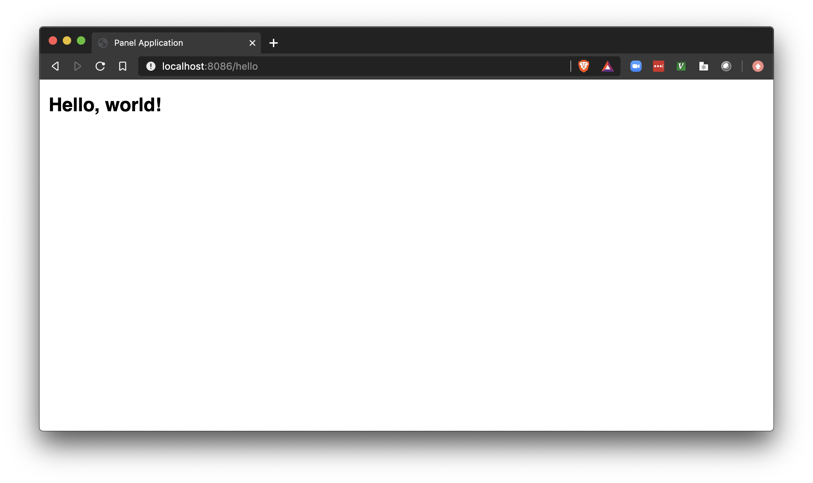

# Anaconda Project builder image

Build docker images from Anaconda Project directories.

## Usage

1. Install [source-to-image](https://github.com/openshift/source-to-image#installation)
2. Optional: Clone this repo and build the base images
```
git clone https://github.com/Anaconda-Platform/s2i-anaconda-project
cd s2i-anaconda-project
make
```

3. Build your own docker image from an Anaconda Project directory

```
s2i build <path-to-project or URL> conda/s2i-anaconda-project-ubi7 <image-name> [-e CMD=<project-command>]
```

* `<image-name>` is the desired Docker image name.
* `<project-command>` is the anaconda-project command to run when `docker run` is executed (optional).

4. Run the docker image
```
docker run -p 8086:8086 <image-name>
```


## Example

Here is an example using the [Hello World](https://github.com/AlbertDeFusco/hello-world) project on Github.


```
>s2i build https://github.com/AlbertDeFusco/hello-world.git conda/s2i-anaconda-project-ubi7 hello-world
error: Unable to load docker config: json: cannot unmarshal string into Go value of type docker.dockerConfig
---> Copying project...
---> Preparing environments...
Nothing to clean up for environment 'default'.
Cleaned.
$ conda create --yes --prefix /opt/app-root/src/envs/default python=3.7 panel
Collecting package metadata (current_repodata.json): ...working... done
Solving environment: ...working... done

## Package Plan ##

environment location: /opt/app-root/src/envs/default

added / updated specs:
- panel
- python=3.7


The following packages will be downloaded:
...
Will remove the following packages:
/opt/app-root/src/.conda/pkgs
-----------------------------

_libgcc_mutex-0.1-main                         7 KB
numpy-1.18.1-py37h4f9e942_0                   24 KB
blas-1.0-mkl                                  15 KB

---------------------------------------------------
Total:                                        46 KB

removing _libgcc_mutex-0.1-main
removing numpy-1.18.1-py37h4f9e942_0
removing blas-1.0-mkl
Build completed successfully
```

You can find the `hello-world` Docker image in your local registry.

```
>docker image ls
REPOSITORY                                       TAG                 IMAGE ID            CREATED             SIZE
hello-world                                      latest              eeb7153e78d3        35 seconds ago      1.96GB
conda/anaconda-project-ubi7                      latest              c3b1890888f8        2 minutes ago       809MB
conda/anaconda-project-centos7                   latest              2f6ce578489b        3 minutes ago       796MB
registry.access.redhat.com/ubi7/s2i-base         latest              7fe1e99b3821        7 weeks ago         471MB
centos                                           7                   5e35e350aded        5 months ago        203MB
openshift/base-centos7                           latest              4842f0bd3d61        3 years ago         383MB
```

Now run the `hello-world` Docker image

```
>docker run -p 8086:8086 hello-world
2020-04-20 17:52:06,460 Starting Bokeh server version 2.0.1 (running on Tornado 6.0.4)
2020-04-20 17:52:06,463 User authentication hooks NOT provided (default user enabled)
2020-04-20 17:52:06,465 Bokeh app running at: http://localhost:8086/hello
2020-04-20 17:52:06,465 Starting Bokeh server with process id: 1
```

When you visit http://localhost:8086 you will see




## Project commands

By default, the s2i assemble step will prepare the docker image for the default command of the project. Within
anaconda-project the default command for a project is the command in the anaconda-project.yml file called `default`.
If a command named `default` is not present then the first command in the anaconda-project.yml file is chosen.

When building the docker image you can choose a non-default command to run with the `-e CMD=<command>` flag. The command
can be either a command defined in the anaconda-project.yml file or an executable in the path of the default `env_spec`
for the project.

## Docker run commands

When the project docker image is built the default runtime command is set to `/usr/libexec/s2i/run`. This script
runs the default command or the one specified at build time. In addition you can execute arbitrary commands from the
project conda environment. Here's an example using the `hello-world` example above.

First the image is built using the default command and you'll see that `docker run` initiates the Panel/Bokeh server.

```
>s2i build https://github.com/AlbertDeFusco/hello-world.git conda/s2i-anaconda-project-alpine hello-world
---> Copying project...
---> Preparing environment for command default...
...
>docker run -p 8086:8086 hello-world
2022-01-10 15:28:01,101 Starting Bokeh server version 2.3.3 (running on Tornado 6.1)
```

Instead the user can run a custom command, for example we'll confirm that these custom commands are executed in the
default Conda environment for the project and all of the appropriate environment variables.

```
>docker run hello-world python -c 'import sys;print(sys.executable)'
/opt/app-root/src/envs/default/bin/python
```

Finally all of the the variables define in the anaconda-project.yml file will be set for use by custom runtime
commands. In this example `BOKEH_ALLOW_WS_ORIGIN: "*"` is defined in the anaconda-project.yml file.

```
>docker run hello-world env
HOSTNAME=f7d56ddd45b4
PWD=/opt/app-root/src
TZ=US/Central
HOME=/opt/app-root/src
LANG=en_US.UTF-8
SHLVL=0
PYTHONDONTWRITEBYTECODE=1
CONDA_VERSION=4.9.2
LC_ALL=en_US.UTF-8
ANACONDA_PROJECT_VERSION=0.10.0
PATH=/opt/app-root/src/envs/default/bin:/usr/local/sbin:/usr/local/bin:/usr/sbin:/usr/bin:/sbin:/bin
PIP_NO_CACHE_DIR=1
CONDA_ROOT=/opt/conda
PROJECT_DIR=/opt/app-root/src
CONDA_PREFIX=/opt/app-root/src/envs/default
CONDA_DEFAULT_ENV=/opt/app-root/src/envs/default
BOKEH_ALLOW_WS_ORIGIN=*
```

## Entrypoints

the `s2i-anaconda-project` builder images provide three entrypoint scripts.

* `/entrypoint.sh`:
    * The default entrypoint that execs `anaconda-project run <cmd>`, where `<cmd>` is the command chosen at build time
      or runtime.
* `/lambda-api.sh`:
    * A cURL-based Lambda runtime that can be used for any command that doesn't utilize the AWS lambda runtime packages.
      This entrypoint receives the event data from AWS and sends it to the command as the first argument
* `/lambda.sh`:
    * This entrypoint expects that your project utilize the runtime package (`awslambdaric` for Python) to communicate
      with AWS Lambda.

### AWS Lambda
To execute the command chosen at build time or a custom command as an AWS Lambda function first build the project image
following the steps above. To execute your image as an AWS Lambda function all you need to do is set the appropriate
entrypoint at runtime.

To test your docker image locally, the AWS Lambda Runtime Emulator has been installed in the builder image. When you
run the docker image locally using either the `/lambda-api.sh` or `/lambda.sh` entrypoint the emulator will launch
and you can make POST requests to the container.

Here's an example where the anaconda-project command does not utilize a Lambda runtime so the `/lambda-api.sh`
entrypoint is enabled.

```
name: test-lambda

packages:
  - jq

commands:
  default:
    unix: jq -ncM '$in | .Key = "output"' --argjson in
```

Here the image is built and run

```
>s2i build -c . conda/s2i-anaconda-project-alpine test-lambda
---> Copying project...
---> Preparing environment for command default...
...
>docker run -p 9000:8080 --entrypoint /lambda-api.sh test-lambda
10 Jan 2022 10:12:36,958 [INFO] (rapid) exec '/usr/libexec/s2i/run-lambda' (cwd=/opt/app-root/src, handler=/usr/libexec/s2i/run)
```

In another terminal make a request to the container

```
>curl -XPOST "http://localhost:9000/2015-03-31/functions/function/invocations" -d '{}'
{"Key":"output"}
```

In the `docker run` terminal you'll see

```
10 Jan 2022 10:12:36,958 [INFO] (rapid) exec '/usr/libexec/s2i/run-lambda' (cwd=/opt/app-root/src, handler=/usr/libexec/s2i/run)
10 Jan 2022 10:13:14,750 [INFO] (rapid) extensionsDisabledByLayer(/opt/disable-extensions-jwigqn8j) -> stat /opt/disable-extensions-jwigqn8j: no such file or directory
10 Jan 2022 10:13:14,751 [WARNING] (rapid) Cannot list external agents error=open /opt/extensions: no such file or directory
START RequestId: ad48ef4a-b9a5-4dee-86ca-16a49bca67ab Version: $LATEST
{"Key":"output"}
END RequestId: ad48ef4a-b9a5-4dee-86ca-16a49bca67ab
REPORT RequestId: ad48ef4a-b9a5-4dee-86ca-16a49bca67ab	Init Duration: 0.48 ms	Duration: 2229.52 ms	Billed Duration: 2230 ms	Memory Size: 3008 MB	Max Memory Used: 3008 MB
```